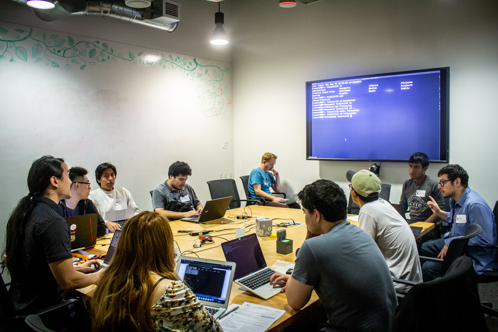

## Civic Tech Design 101 for the Next Generation of Tech Talent

Code for San Francisco is a community space where volunteers network, experiment, explore new skills, job-seek and build projects to serve community needs. The Dev/Mission Fellowship began as a pilot program in 2018 to see if the C4SF volunteer community could also be engaged to mentor San Francisco’s underserved communities in civic tech. Long-time core team member Allen Meyer, and then captain, Emily Wasserman wrote the original proposal for the Fellowship. They saw the opportunity for mentorship from the volunteers and a chance for the Fellows to manage a civic tech project from initial concept to MVP. To help make this program a success, we partnered with Dev/Mission, an organization its CEO Leo Sosa describes as “a nonprofit organization that aims to train untapped young adults for careers in tech who can bring prosperity to underserved communities”.

The results of the first two cohorts of Fellows were promising enough that it was decided to expand the group from 6-8 Fellows to thirteen for the third cohort. The Fellows are taken through a civic tech design process that ended up with five projects sourced from community needs they identified as part of the design process.

### Three-way partnership

Collaboration can be a great way for organizations to leverage each other’s strengths to build something bigger than what they might be able to do alone. Dev/Mission has several programs designed to help young people from San Francisco’s underserved communities develop STEM skills and tech careers. They invited thirteen graduates from one of these programs, the Pre-Apprenticeship Bootcamp, to participate in the Fellowship.

Francis Li, Dev/Mission board secretary, has been facilitating the development of the Fellowship between the partners and actively engaging the fellows as the lead coding mentor. He described his experience this way: "As a long-time brigade volunteer, it's been exciting and very rewarding to be able to combine the diversity and equity initiative of Dev/Mission with the civic technology projects of Code for San Francisco in providing new opportunities for young people in our city to learn about careers in technology." Within the brigade, Francis was a key contributor to Intentional Walk, an app developed by C4SF for the SF Department of Public Health. The third partner is a corporate sponsor; Microsoft funded the first cohort, with Uber stepping up to both fund the stipends as well as provide coding mentorship for the second and third cohorts.

*Uber Fellows watching a demonstration by Uber Fellowship Instructor, Francis Li, inside Uber HQ*

## Process: Civic Tech Design 101:

The Fellowship is about the same length of time as a college semester, and many of the Fellows are enrolled in college. They spent Tuesday nights with the Uber engineers and Wednesday nights at C4SF’s weekly hack nights. Several designers, and C4SF regulars, volunteered to be design mentors for the duration of the Fellowship: Britt Jensen, [Callum Leneman](https://www.callumleneman.com/), Helen Lerums and Sam Kim. We had them form teams around a community need they wanted to address, and then took them through a user centered design approach to product development. We have adopted how a civic tech project might come together to inform the Fellowship curriculum.  The user centered design process has the following components:

### Community needs workshop

We began by asking them what are some issues in their communities they would like to address through a tech project. Some of these topics might be broad, such as helping the homeless in their neighborhood. We then worked with them to narrow down what that help might look like, and then conduct research based on those ideas. We have them form teams at this time around those subject areas, with the caveat that they can switch topics early in the process.

### Design research

First, we ask them to do desk research on their topic to gather data and find out what other organizations may be doing to address the topic. We then help them put together interview guides around their topics to interview their friends, family members and neighbors.

### Brainstorming and Ideation

Using their desk research and insights from their interviews, we have them pull out key insights they’ve learned, and we begin to brainstorm possible ideas to address those needs.

### Persona and User Journeys

We have them develop personas of the people who might use their proposed solution, with the next step being to develop user journeys. We find that creating storyboard style user journeys are a great way to help them think outside of the browser.

### Wireframing

This is where all the research and brainstorming starts to come together as a potential web app project. We ask them to show us how a user will complete the solution they have identified in their user journeys. They are also introduced to information architecture.

### Branding and UI/UX

We introduce them to basic concepts in branding and UI design and how these will support the user experience. As part of this, we have them draft a mission statement for their project.

### Web Development

During the Tuesday night sessions with Uber, the Fellows build upon the skills they learned in the Dev/Mission Pre-apprenticeship Bootcamp- including HTML, CSS, and JavaScript- to learn full-stack web development. That is, they are introduced to the technologies used not only to code web pages that can render in a browser, often called front-end development, but also to build web servers that provide application programming interfaces (APIs) and can store data for an interactive web application, known as back-end development. These technologies include React on the front-end, and Node.js, Express, and Postgres on the backend. At the same time, by working in project teams, they learn about and gain hands-on experience with the work practices and tools used by software engineers to collaborate on large projects, including Docker and the git version control system.

## The Age of Zoom:

This was our first Fellowship to take place under the restrictions of COVID. Previous Fellowships had followed the collaborative in-person nature of hack nights. Teams are able to make quick, collaborative decisions, quickly visualizing ideas on a whiteboard and dividing up tasks. Could we replicate this process virtually, while also introducing them to user centered design concepts? Our tools were Slack, Zoom, Mural, the ubiquitous Google Suite and Figma. The restrictions placed on collaboration turned out to have been a great introduction to many of the tools design teams use.

## Volunteers of America

C4SF projects generally have a core of one or more volunteers who maintain and sustain a project. There is generally a continuous recruitment for new volunteers to add to this team. We have found this challenging with previous Fellowships. Pitching one’s project is a good skill to learn, but the Fellows really need a more consistent mentoring experience to keep their projects moving forward. Uber and Dev/Mission provided developer volunteers committed to the entire Fellowship time period. C4SF recruited several designers who agreed to mentor and lend design support for the entire Fellowship period. This relieved a great deal of pressure in needing to recruit support every week. The trade off is that the Fellows spent less time needing to stand up in front of a room full of C4SF volunteers pitching their project ideas. This can be a nerve wracking experience for even experienced designers and previous Fellows gained valuable experience learning to pitch their ideas.

## The Projects

*5 projects, 13 Fellows*

### Bulga

Bulga creates mindsets, not just budgets. We bring motivation and ease to budgeting by providing savings goals and intuitive tracking tools to help users develop their personal financial health stability.

### CodeSwitch

Codeswitch is an initiative to pre-expose collegiate students to a variety of careers in tech through mentorship and unconventional networking opportunities.

### FairPlay

Provide students with the technology that they need at NO cost. We do this by creating a platform where Donors, Local Programs, and Nonprofits can coordinate to receive and distribute technology reliably.

### GardenSpace

GardenSpace raises awareness of community gardens by facilitating learning and volunteering opportunities in San Francisco’s community gardens. For organizers, GardenSpace helps them connect with members of the community to help maintain the garden and share what is grown.

### SmolBiz

Bringing fun to supporting small businesses, incentivizing community members to shop locally.

## Future Tech Leaders

Fellows not only learn current technology, but are given an opportunity for project management and leadership using technology to address important community needs. Fellow Zizo Ezzat summarized his experience this way: “I think that this truly was a unique experience that felt like creating a startup from scratch. I had a true taste of what it's like to work for a company since I had to concern myself with the business, technical, and developmental side of creating a web app. This experience is valuable and I would not have been able to acquire it so early into my education because most internship programs are looking for older students.”

## What’s Next?

Much of the value in the Fellowship projects is in the learning experience for the Fellows. Several of the Fellowship projects are still in development: [SF Dreamer](https://sfdreamer.org/) from the Spring 2020 Fellowship is still in development. It is a resource guide for undocumented youth to learn about how to apply for college. Dev/Mission is also considering using FairPlay as a platform for its technology donation and distribution program. CodeSwitch will be hosting in-person recruitment events later this year. At the same time, planning is ongoing for the Fall 2021 cohort as well.

Interested in helping to mentor the next generation of tech talent? Email allen@codeforsanfrancisco.org for more information.

[**Demo Night Slide Deck**](https://docs.google.com/presentation/d/1iSqR80V9O29-TcOd-tFO1OZVg9fVKnahIDC8IFbatbs/edit?usp=sharing)

[Allen Meyer](https://www.linkedin.com/in/allenmeyer/) is a visual designer with the San Francisco Human Services, Innovation Office. He is a long time volunteer and organizer with Code for San Francisco and believes the open and collaborative community there is great opportunity to explore civic tech and community service.
