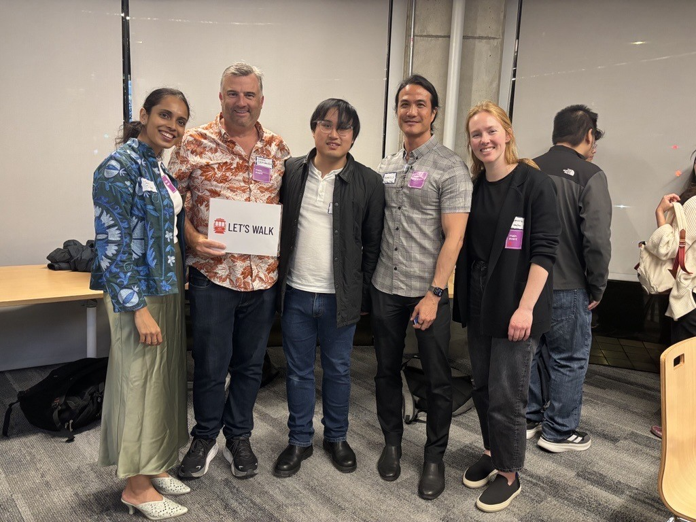
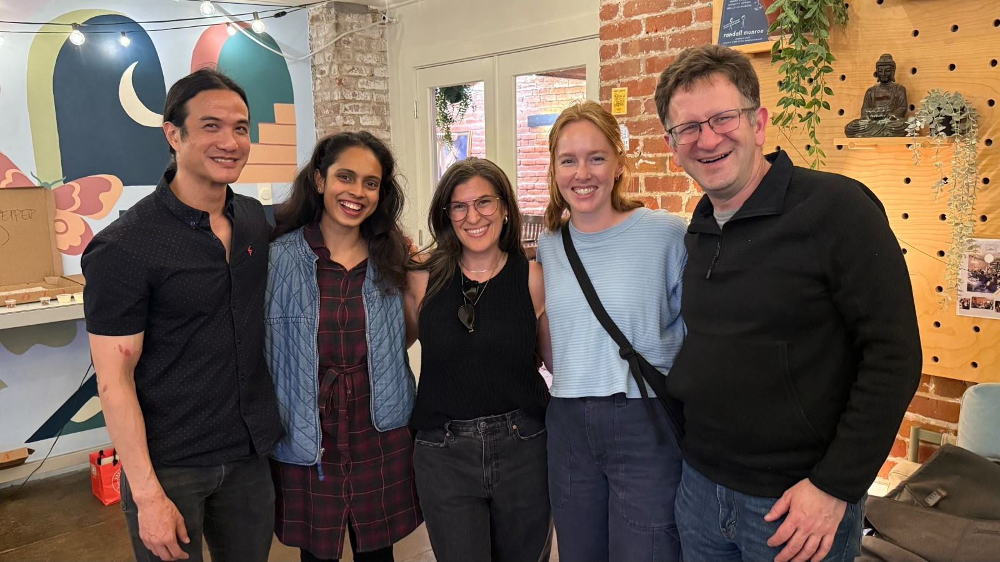
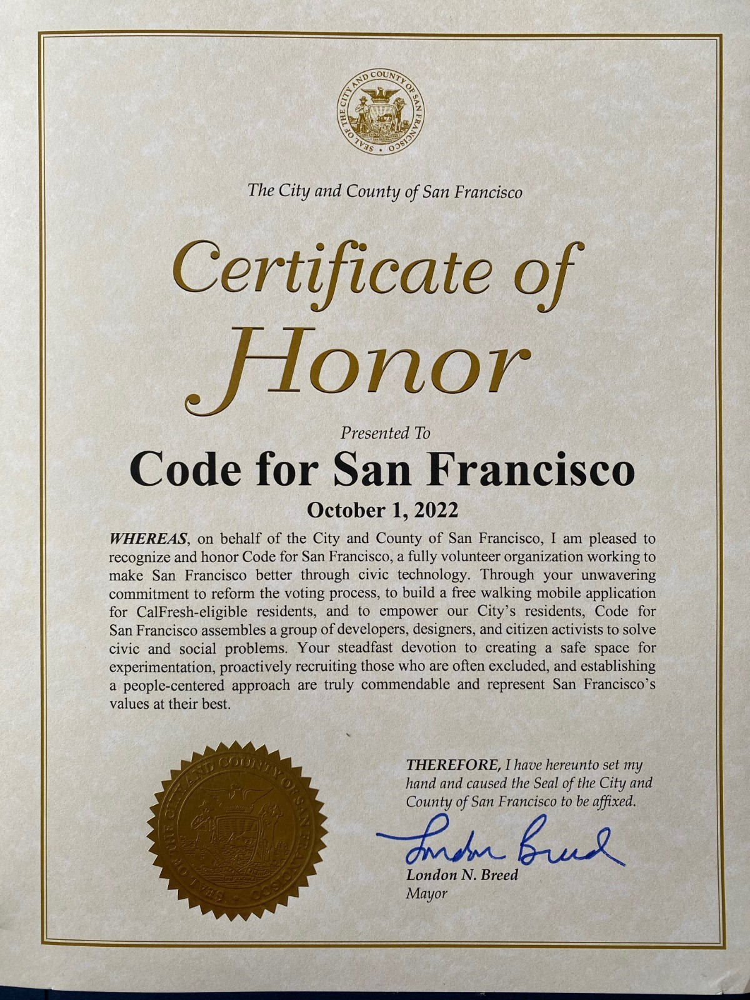

_Editor’s note: This post was written collectively by the SF Nutrition Equity Opportunity & Physical Activity (SF NEOP) team from the City and County of San Francisco's Department of Public Health. On July 4, 2025, the federal budget reconciliation bill known as the One Big Beautiful Bill Act was signed in to law, eliminating all funding for the Nutrition Education and Obesity Prevention Grant Program (also known as SNAP-Ed, Supplemental Nutrition Assistance Program Education) effective October 1, 2025. As a result, the SF NEOP team was disbanded and the Let’s Walk program has been sunsetted. SF Civic Tech would like to thank the SF NEOP team for their vision, leadership, and collaboration alongside all the volunteers who worked on building the technology for the program over the years._

Since 2019, the Let’s Walk program has brought thousands of San Franciscans together, one step at a time. What began as a modest pilot evolved into a community-powered walking challenge that blended technology, sports, and public health—reaching hundreds of families in neighborhoods with some of the city’s greatest health disparities.

As we prepare to sunset Let’s Walk on September 30, 2025, we’re proud to reflect on the innovation, partnerships, and equity-driven design that made this program a model for what’s possible when community voice leads the way.

### The Journey
Originally piloted in partnership with CDPH and the Argus fitness app, the first iteration of Let’s Walk (then called Intentional Walk) ran for four weeks in 2019. Our team at SF Nutrition Equity Opportunity & Physical Activity (SF NEOP) recruited participants directly from local hubs: the Heart of the City Farmers Market, food pharmacies, community health fairs, and the public library. The draw? Simple: track your steps, and you might win SF Giants gear. The result? A 255% increase in enrollment compared to the original 2018 pilot in Stanislaus County. 

But we didn’t stop there. 

### Listening and Learning
We heard from our community loud and clear: the app needed to be easier to use, ad-free, and available in multiple languages. We faced a choice—continue tweaking a third-party platform or build our own. We took the leap and partnered with San Francisco Civic Tech (formerly, Code for San Francisco), a team of civic tech volunteers dedicated to solving local problems with inclusive design and open-source tools.

Together, we co-designed a mobile app tailored for our diverse, multilingual participants—complete with neighborhood walking maps, trilingual onboarding, goal-setting, leaderboard, and user-friendly visuals, all written at a fifth-grade reading level. 

### Equity in Action
From the start, Let’s Walk was grounded in three guiding principles: equity, community-informed design, and partnership. We worked hand-in-hand with WIC to launch a fully virtual recruitment campaign during the pandemic, reaching nearly 6,000 San Francisco families through trilingual text messages and digital guides. Over 400 participants enrolled in the 2020 program—demonstrating that virtual outreach, when done intentionally, can truly work. 

Our data has told a powerful story: 
*	A total of 490 million steps logged (over 245,000 miles!) 
*	Most participants lived in zip codes with high rates of poverty and chronic disease 
*	After adding the Where to Walk feature, >80% of respondents consistently reported walking at a local park during the program 
*	On average, respondents consistently reported that friends and/or family walked with them >3 days per week 
*	Participants indicated experiencing health benefits associated with physical activity, including higher energy levels, lower stress, and improved sleep quality  
*	In 2023, 79% of participants reported making healthy lifestyle changes as a result of participating in the program, including movement, nutrition, and other health behaviors 

When participants were asked what they liked most about the app, the top responses were its ease of use, the ability to track steps, and the motivation to stay active. And >90% of survey respondents consistently said they would rejoin the program—a testament to the program’s relevance and value. 
 
### Participant Voices
Behind every data point is a neighbor, parent, or community member who took steps toward better health. Their words capture the true spirit of Let’s Walk: 

*	“I am very happy to participate.” 
*	“Thank you for taking care of our health.” 
*	“I really appreciate participating in this program because I feel more energized now.” 
*	“Thank you for the motivation.” 
*	“It’s a great app, I hope many people enjoy it.”

These reflections remind us that Let’s Walk was more than an app or a program—it was a movement powered by community. 

### Looking Ahead
As we wind down this chapter, we remain hopeful that the lessons learned from Let’s Walk will live on. This program proved that public health can innovate, that partnerships between city agencies and volunteer tech groups can thrive, and that when you design with equity in mind, meaningful change is possible.  
 
To our participants, partners, and neighbors: thank you for walking with us. 

We may be taking our last official steps, but the path we paved together will continue to lead toward healthier, more connected communities. 

| More Team Photos |  |
|---|---|
|  |  | 

